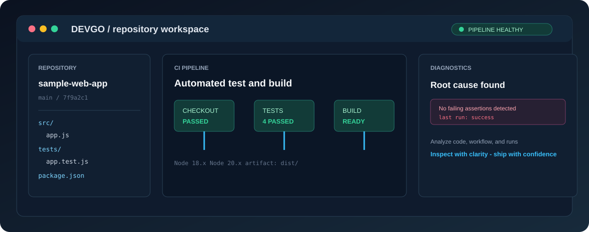

# ⚡ DevGo

> **Stop wrestling with buggy code in isolation.** Paste any GitHub repository URL, instantly map out its codebase, run tests, and diagnose root causes—all inside one unified, developer-first environment.

<p align="center">
   
</p>

<p align="center">
   
</p>

---

## 🚀 What is DevGo?

**DevGo** is designed to take the friction out of code analysis, testing, and CI/CD debugging. Instead of spending hours cloning, configuring local environments, tracking down broken dependencies, and digging through nested directories manually, DevGo gives developers an immediate, bird's-eye view of any public or private GitHub repository.

Whether you're fixing a complex bug, reviewing an open-source pull request, or auditing a legacy project, DevGo streamlines your workflow into three simple steps: **Analyze → Test → Debug.**

---

## ✨ Key Features

- 🔍 **Instant Repo Analysis**: Paste a GitHub repository link to automatically scan structure, file dependencies, workflow files, and potential code smells.
- 🧪 **Automated Testing & CI Simulator**: Run unit and integration tests across multiple environments (Node.js matrix, Python, Docker) with real-time log output.
- 🐛 **Interactive Break-Fix Lab**: Practice diagnosing real-world CI failure scenarios including assertion failures, missing scripts, and GDScript index out-of-bounds errors.
- 🤖 **AI DevOps Copilot**: AI-assisted pipeline error diagnostics and production-grade GitHub Actions workflow YAML generation powered by Gemini.
- 📊 **Architecture Insights**: Visualize CI/CD architectures, runner lifecycles, and caching strategies.
- 📦 **One-Click Repo Export**: Export generated workflow configurations and repository fixes directly as a zip archive.

---

## 🛠️ How It Works

```
📥 Paste GitHub URL  ───▶  🧐 Code Analysis  ───▶  🧪 Run Tests  ───▶  🛠️ Fix & Debug
```

1. **Paste**: Drop your repository link into DevGo.
2. **Inspect**: DevGo parses the codebase structure, dependencies, and GitHub Actions workflows.
3. **Execute**: Run test suites or simulate edge cases to isolate failing logic.
4. **Resolve**: Target the exact bugged lines and apply fixes with complete clarity.

---

## ⚙️ Quick Start

### Prerequisites
- [Node.js](https://nodejs.org/) (v18 or higher recommended)
- [Git](https://git-scm.com/)

### Installation

1. **Clone the repository:**
   ```bash
   git clone https://github.com/Cid-oe/devgo.git
   cd devgo
   ```

2. **Install dependencies:**
   ```bash
   npm install
   ```

3. **Set up environment variables:**
   Create a `.env` file in the root directory:
   ```bash
   cp .env.example .env
   ```
   Configure your keys in `.env`:
   ```ini
   PORT=3000
   GEMINI_API_KEY=your_gemini_api_key_here
   GITHUB_TOKEN=your_personal_access_token
   ```

4. **Launch the development server:**
   ```bash
   npm run dev
   ```

   Open [http://localhost:3000](http://localhost:3000) in your browser.

---

## 📁 Project Structure

```
devgo/
├── App.tsx                    # Main interactive application view
├── server.ts                  # Express backend & API endpoints
├── index.html                 # App entry point HTML
├── index.tsx                  # React DOM rendering entry
├── vite.config.ts             # Vite build & dev-server configuration
├── tsconfig.json              # TypeScript configuration
├── docs/                      # Documentation and architecture diagrams
│   └── images/                # Overview and workflow SVG diagrams
└── src/
    ├── components/            # UI components (Visualizer, Logs, Studio, etc.)
    ├── data/                  # Lab steps, pipeline presets, quizzes
    ├── services/              # Gemini AI client and analysis helpers
    └── types.ts               # Shared TypeScript interfaces
```

---

## 🤝 Contributing

Contributions make the open-source community an incredible place to learn, inspire, and create. Any contributions you make are greatly appreciated!

1. Fork the project
2. Create your feature branch (`git checkout -b feature/AmazingFeature`)
3. Commit your changes (`git commit -m 'Add some AmazingFeature'`)
4. Push to the branch (`git push origin feature/AmazingFeature`)
5. Open a Pull Request

---

## 📜 License

Distributed under the MIT License.
